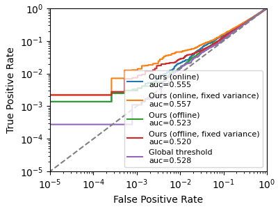

# Likelihood Ration Attack (LiRA) in PyTorch

This repository contains the implementation of the original [LiRA](https://github.com/tensorflow/privacy/tree/master/research/mi_lira_2021) using PyTorch. CIFAR-10, MalIMG, and MalNet datasets are implemented for the attack. To run the code, first create an environment with the `env.yml` file. Then run the following command to train the models and run the LiRA attack:

```bash
conda env create -f env.yml
conda activate lira_env
./run.sh
```

The output will generate and store a log-scale FPR-TPR curve as `./fprtpr.png` with the TPR@0.1%FPR in the output log.

All datasets now resolve from the repository's shared `data/` directory by default. CIFAR-10 uses `data/cifar`, MalImg uses `data/malimg`, and MalNet uses `data/malnet_resized_32x256` (or a custom path you pass with `--dataset_path`).

To use the MalNet dataset, run the pipeline with `--dataset malnet`. The first run will download the archive from Google Drive into the repository's `data/` directory and extract it to `data/malnet_resized_32x256`.

## Results on MalIMG

Using 16 shadow models trained with `ResNet18 for 100 epochs with 18 augmented queries`:



```
Attack Ours (online)
   AUC 0.5549, Accuracy 0.5371, TPR@0.1%FPR of 0.0030
Attack Ours (online, fixed variance)
   AUC 0.5567, Accuracy 0.5381, TPR@0.1%FPR of 0.0129
Attack Ours (offline)
   AUC 0.5233, Accuracy 0.5204, TPR@0.1%FPR of 0.0033
Attack Ours (offline, fixed variance)
   AUC 0.5205, Accuracy 0.5210, TPR@0.1%FPR of 0.0074
Attack Global threshold
   AUC 0.5282, Accuracy 0.5285, TPR@0.1%FPR of 0.0011
```

## Results on CIFAR10

Using 16 shadow models trained with `ResNet18 and 2 augmented queries`:


```
Attack Ours (online)
   AUC 0.6548, Accuracy 0.6015, TPR@0.1%FPR of 0.0068
Attack Ours (online, fixed variance)
   AUC 0.6700, Accuracy 0.6042, TPR@0.1%FPR of 0.0464
Attack Ours (offline)
   AUC 0.5250, Accuracy 0.5353, TPR@0.1%FPR of 0.0041
Attack Ours (offline, fixed variance)
   AUC 0.5270, Accuracy 0.5380, TPR@0.1%FPR of 0.0192
Attack Global threshold
   AUC 0.5948, Accuracy 0.5869, TPR@0.1%FPR of 0.0006
```

Using 16 shadow models trained with `WideResNet28-10 and 2 augmented queries`:


```
Attack Ours (online)
   AUC 0.6834, Accuracy 0.6152, TPR@0.1%FPR of 0.0240
Attack Ours (online, fixed variance)
   AUC 0.7017, Accuracy 0.6240, TPR@0.1%FPR of 0.0704
Attack Ours (offline)
   AUC 0.5621, Accuracy 0.5649, TPR@0.1%FPR of 0.0140
Attack Ours (offline, fixed variance)
   AUC 0.5698, Accuracy 0.5628, TPR@0.1%FPR of 0.0370
Attack Global threshold
   AUC 0.6016, Accuracy 0.5977, TPR@0.1%FPR of 0.0013
```

## Folder structure

Below is the repository's current top-level folder structure and a short description of each entry. This should help navigate the project and locate scripts, experiments, and results.

```
lira-pytorch/
├── exp/                    # experiment outputs and checkpoints
│   ├── cifar10/            # CIFAR-10 experiment runs (subfolders per run)
│   │   ├── 0/
│   │   └── 1/
│   └── malimg/             # MalImg experiment runs (subfolders per run)
│       ├── 0/
│       ├── 1/
│       ├── 2/
│       └── 3/
├── figures/                # pre-generated figures (ROC / curves)
│   ├── fprtpr_resnet18.png
│   ├── fprtpr_resnet18_malimg.png
│   └── fprtpr_wideresnet.png
├── dataset_utils.py        # dataset loading / preprocessing helpers
├── train.py                # training script for models and shadows
├── inference.py            # run inference / LiRA attack pipeline
├── score.py                # scoring / evaluation utilities
├── plot.py                 # plotting utilities
├── wide_resnet.py          # WideResNet model definition
├── run.sh                  # convenience script to run full pipeline
├── env.yml                 # conda environment specification
├── README.md               # this file
├── LICENSE
├── .gitignore
└── (other scripts and images)
```

Notes:
- Datasets are expected to be resolved from a top-level `data/` directory by default (see above sections describing dataset paths). If `data/` is not present in the repository, create it at the top level and place dataset folders as required (e.g., `data/cifar`, `data/malimg`, `data/malnet_resized_32x256`) or use the `--dataset_path` option where supported.
- The `exp/` directory contains per-run outputs (checkpoints, logs, attack results). Each numeric subfolder corresponds to an experimental run.
- Add or update entries here if the folder layout changes in the future so the README stays accurate.
